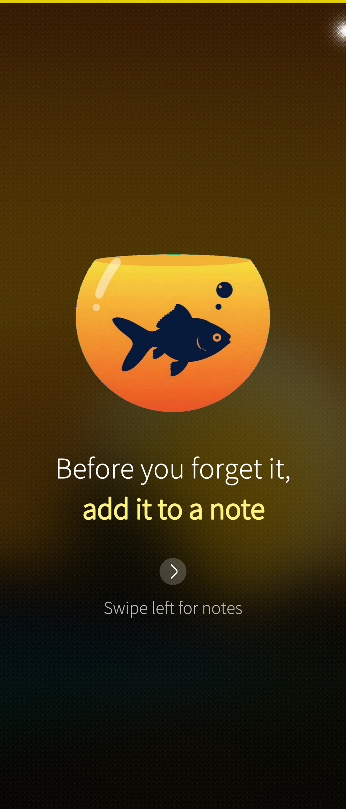
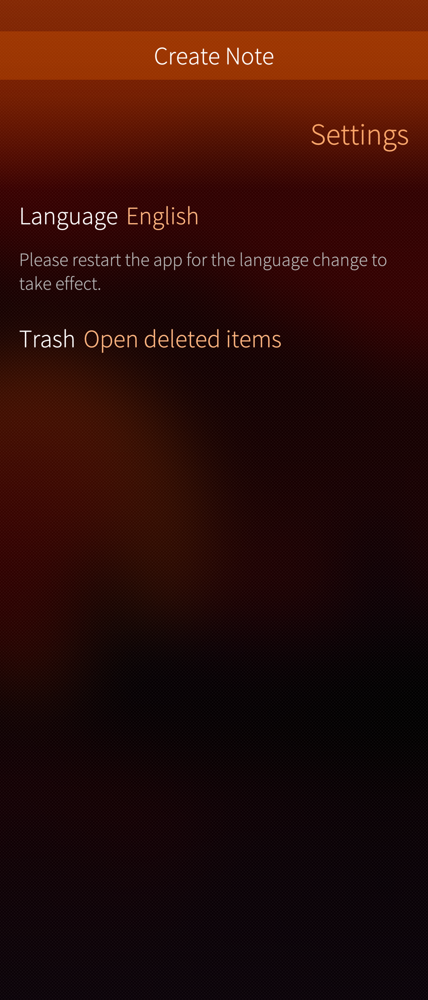
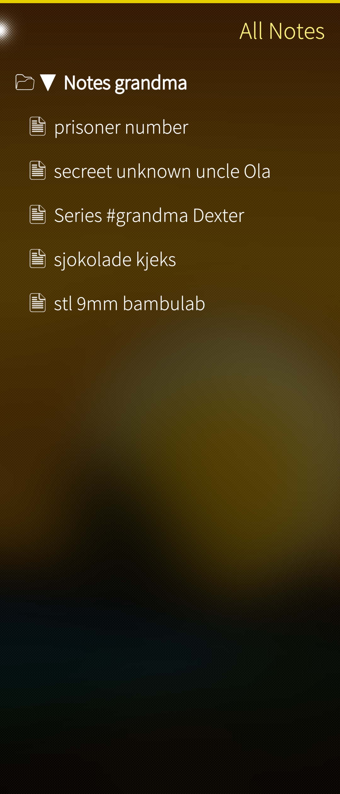
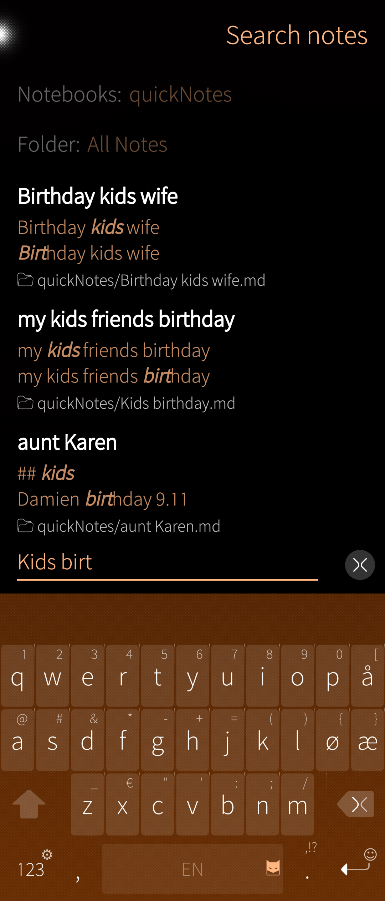
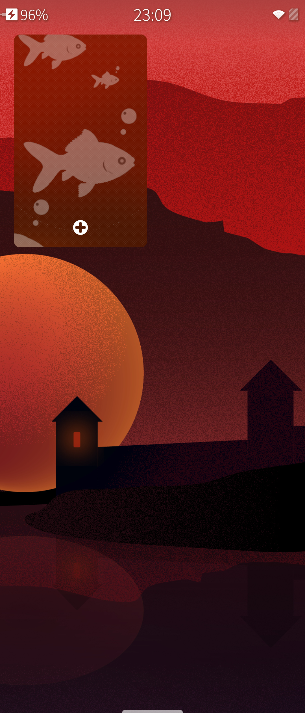

# camemo
Light Notetaking app. 

Let’s be honest: Carassius auratus (the humble goldfish) has roughly the same memory span as the creator of this app.

Ideas flash by like lightning—brilliant sparks that vanish before you can blink. That TV show your grandma whispered about? The one that totally might flipped your perception of her forever? Gone. Poof.

But here’s the thing: with CA Memo, you can scribble it down in a heartbeat.

"Series #Grandma Dexter" → Done.

And the best part? If you can recall even a tiny fragment of that note—just a word, a feeling, a half-baked thought—it’ll pop back up faster than you can forget it again.

Sure, you could organize your notes into fancy folders and meticulously labeled notebooks. But let’s be real: if you’re anything like me, that structure will crumble faster than a dry biscuit. You won’t remember where you filed it anyway. So why bother?

CA Memo gives you the freedom to organize… if you really want to. But if you’re like us? Just toss everything into one big, chaotic notepad. Throw in a few keywords, and let the search engine do the heavy lifting.

Because at the end of the day, all you need to remember is:

"Grandma suggested a show that sounded kinda f*****."

The rest? We’ve got it covered.

Search: #Grandma

One swipe down from anywhere to create a note

NB:

This app is built upon original ideas, functional requirements, and design concepts created by the developer. AI tools were extensively used to assist with the coding process and translation.

#### Mainpage
click the fish to add a note

#### Create note from every place in the app 
(even inn settings)

#### List notes
List your notes

#### Search
One of aunt Karens kids has a birthday soon. 

#### add a note from the coverpage

